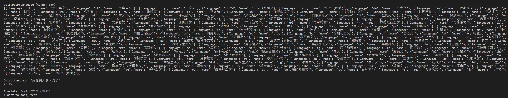

# GoogleTranslateAPITest
2023/12/03 串接測試 Google API 使用

說明：
1. ***記得需要放自己的 API Key，使用Json格式，Example:"{'Key':'aaa'}" (aaa為自己的API Key)***
2. 共有 136 種語言 [Link](https://cloud.google.com/translate/docs/languages)，這裡的第一個 target 是方便顯示成中文，其實可以不使用
3. 可以偵測語言，使用 "DetectLanguage"
4. 翻譯，建議填寫 source 語言，也可以用上方的偵測結果 (記得，需要用簡寫，如第一點的 Output 的 language)
